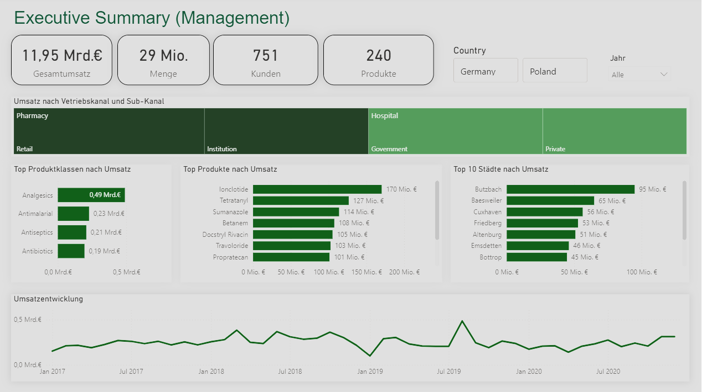

# Pharmaceutical Sales Analysis

## Project Overview

This project presents an interactive Power BI dashboard for analyzing pharmaceutical sales performance across Germany and Poland.

The dashboard provides management and sales teams with a clear overview of revenue, sales quantity, customers, products, distribution channels and regional performance.

## Dashboard Preview

## Key Performance Indicators

- **Total Sales:** €11.95 billion
- **Quantity Sold:** 29 million units
- **Customers:** 751
- **Products:** 240

## Business Questions

The dashboard was designed to answer the following questions:

- How has revenue developed over time?
- Which sales channels and sub-channels generate the highest revenue?
- Which product classes and individual products perform best?
- Which cities contribute the most to total sales?
- How does sales performance differ between Germany and Poland?
- Which periods show noticeable changes or peaks in revenue?

## Dashboard Features

- Executive KPI overview
- Country and year filters
- Revenue analysis by sales channel and sub-channel
- Top-performing product classes
- Top-performing pharmaceutical products
- Top cities by revenue
- Monthly revenue development
- Interactive filters for exploring the data

## Key Insights

- Analgesics are the highest-revenue product class in the dashboard overview.
- Ionclotide is the top-performing individual product by revenue.
- Pharmacy and hospital are the main distribution channels.
- The revenue trend shows several fluctuations and a noticeable peak in 2019.
- The dashboard enables comparisons between Germany and Poland.

## Tools and Technologies

- Power BI
- Power Query
- DAX
- Data Cleaning and Transformation
- Data Modeling
- Interactive Data Visualization

## Project Workflow

1. Imported and reviewed the pharmaceutical sales dataset
2. Cleaned and transformed the raw data using Power Query
3. Corrected data types and prepared the data for analysis
4. Created measures and KPIs using DAX
5. Designed interactive dashboard pages for different business users
6. Analyzed revenue, products, customers, locations and sales channels

## Repository Contents

- `pharmaceutical-sales-dashboard.pbix` – complete interactive Power BI dashboard
- `dashboard-overview.png` – preview of the executive management dashboard
- `pharma-sales-sample.xlsx` – sample of the dataset used for the analysis

## How to View the Dashboard

The dashboard preview is displayed directly above.

To explore the complete interactive dashboard:

1. Download `pharmaceutical-sales-dashboard.pbix`
2. Open the file in Power BI Desktop
3. Use the available filters and dashboard pages to explore the analysis

## Data

A sample of the dataset is included for demonstration purposes.

The dataset contains information about:

- Countries and cities
- Customers and distributors
- Pharmaceutical products and product classes
- Sales channels and sub-channels
- Quantity, price and revenue
- Sales representatives and sales teams
- Month and year

## Author

**Annika Heyer**

Junior Data Analyst with experience in Power BI, Python, SQL, data cleaning and exploratory data analysis.

[Connect with me on LinkedIn](https://www.linkedin.com/in/annika-heyer-bb75b8419)
